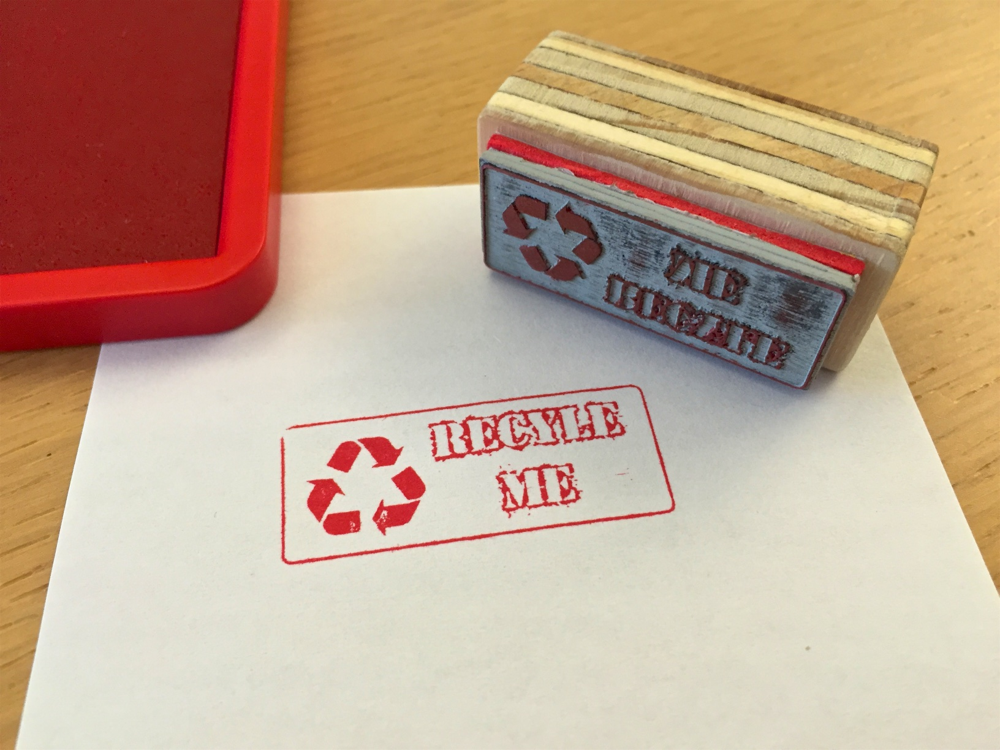

# Recycle Me Stempel
Am 24. April 2017 fand im Fablab Zürich der ['Workshop: Mach dir deinen eigenen Stempel'](http://zurich.fablab.ch/events/workshop-mach-dir-deinen-eigenen-stempel-beim-zopfzmorga/) statt. Dabei habe ich folgenden Stempel gemacht.

## Werkzeuge und Material
* Vektor Grafik Editor 'Inkscape' [Home Page](https://inkscape.org/)
* Font 'War Wound' [1001 Free Fonts](http://www.1001freefonts.com/war_wound.font)
* Trodat [Lasergummi AERO](http://www.trodat.net/de-DE/produkte/Produktionsmaterial/Lasergummi/Pages/produkte.aspx) Format: A4/2,3mm, Farbe: hellgrau Härte: 60 ShA
